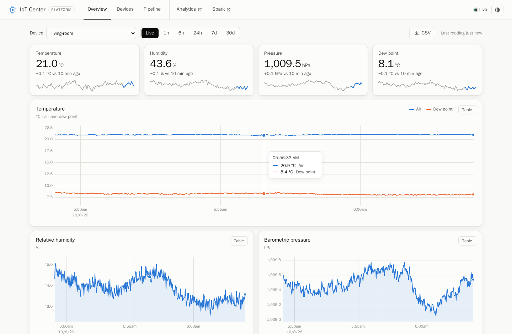
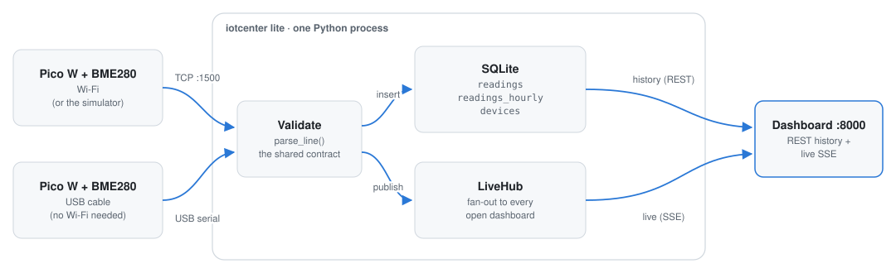
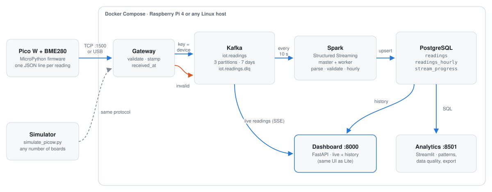
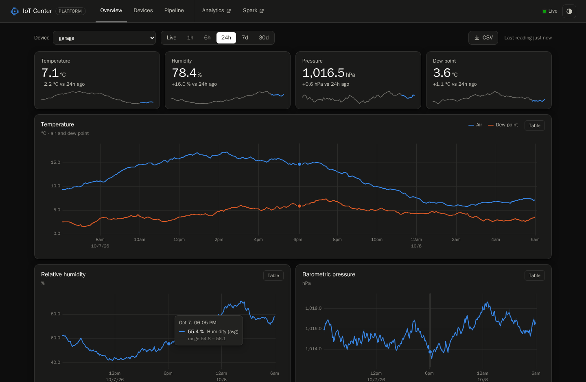
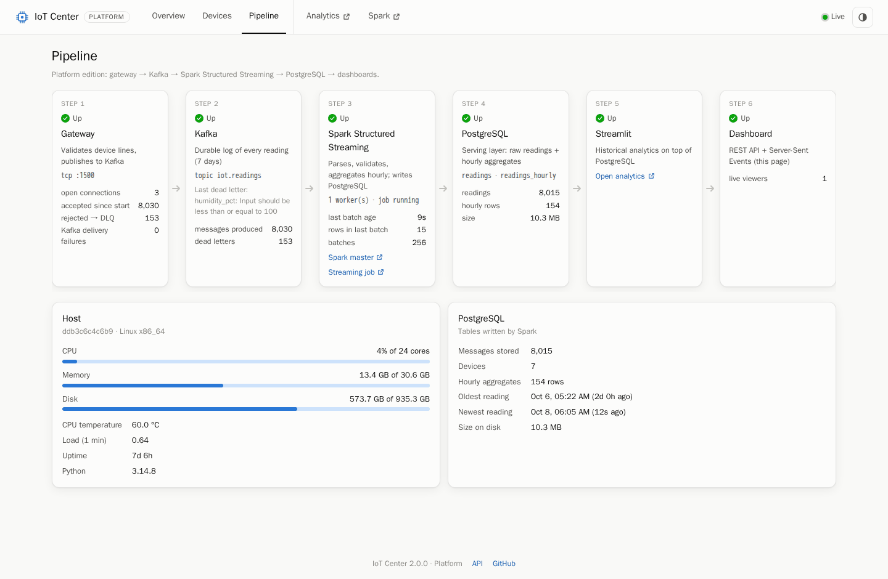
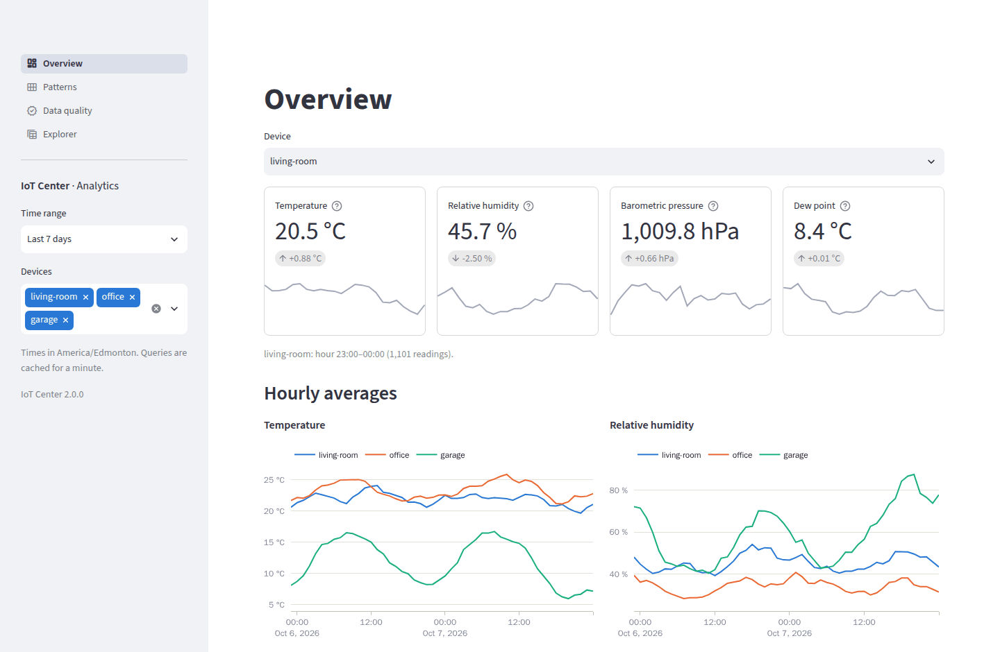
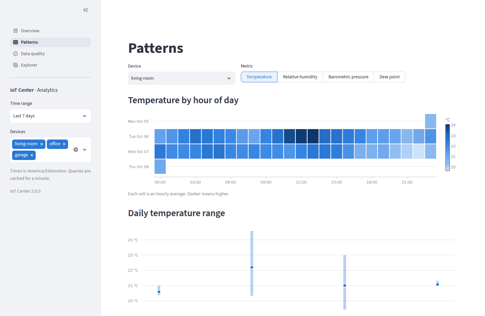
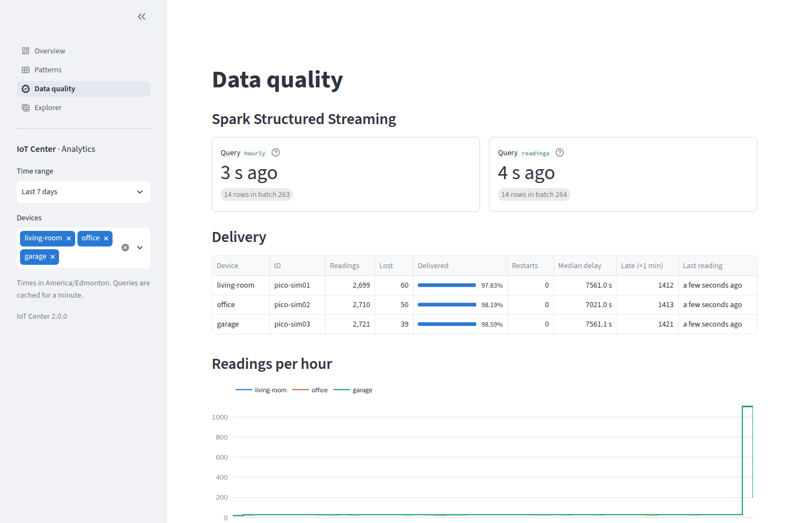
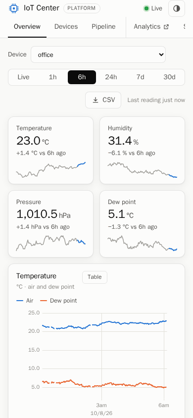

# IoT Center

**Temperature, humidity and pressure from Raspberry Pi Pico W boards, from the breadboard to the dashboard.**

A Pico W reads a BME280 sensor and streams one JSON line per reading: over USB when it is plugged into the
machine running IoT Center (Wi-Fi off), over Wi-Fi when it is not.
IoT Center receives, validates, stores and charts those readings, live and historically.
It comes in two editions that share the same firmware, the same message contract and the same dashboard:

| | **Lite** | **Platform** |
|---|---|---|
| What runs | one Python process | Kafka, Spark Structured Streaming, PostgreSQL, Streamlit, Docker Compose |
| Ingestion | TCP and USB serial | gateway: TCP (and USB) into Kafka, with a dead-letter topic |
| History | SQLite: raw readings + hourly aggregates | PostgreSQL written by Spark: raw readings + hourly aggregates |
| Analytics | dashboard history (1 h to 30 days), CSV export | the same, plus a Streamlit app: patterns, data quality, explorer |
| Camera | optional USB webcam: live view at full quality, motion, zones (water on a floor, a status light), motion clips kept 30 days, and with its microphone, smoke/CO alarm detection ([camera](docs/camera.md)) | not yet |
| Footprint | about 100 MB of RAM | about 3.5 GB of RAM (fits a Raspberry Pi 4 with 8 GB) |
| Start with | `iotcenter lite` | `docker compose up -d` |
| Good for | one or a few boards, a laptop, a Pi Zero 2, USB-only setups | learning and showing off a real streaming data platform |



## How it works

### Lite: one process

<picture>
  <source media="(prefers-color-scheme: dark)" srcset="docs/img/architecture-lite-dark.svg">
  
</picture>

Each line from a board is validated against the [message contract](docs/protocol.md), stored in SQLite
(raw readings, an hourly rollup and a device registry) and pushed to every open dashboard over
Server-Sent Events. There is no broker and no database server, just one process and one file.

### Platform: a streaming pipeline

<picture>
  <source media="(prefers-color-scheme: dark)" srcset="docs/img/architecture-platform-dark.svg">
  
</picture>

1. The **gateway** validates each line and publishes it to Kafka, keyed by device so every board's readings stay in order. Invalid lines go to a dead-letter topic, with the reason.
2. **Kafka** keeps a durable, replayable seven-day log of every reading.
3. **Spark Structured Streaming** reads Kafka every 10 seconds. It parses and validates against an explicit schema, then computes hourly aggregates with an event-time watermark. It writes both to PostgreSQL with idempotent upserts, so a replayed micro-batch never duplicates anything.
4. The **dashboard** streams live readings straight from Kafka (a reading appears in the browser about 10 ms after it reaches the gateway) and reads history from PostgreSQL.
5. **Streamlit** turns the PostgreSQL tables into analytics: daily rhythms, ranges, delivery quality and a raw-data explorer.

The [architecture guide](docs/architecture.md) explains each design decision: why NDJSON over a persistent socket,
why the Kafka key is the device, how exactly-once writes work, and what happens when each piece fails.

## Quick start

### Try it in two minutes, no hardware needed (Lite)

```bash
git clone https://github.com/mpavanetti/iot.git && cd iot
python3 -m venv .venv && . .venv/bin/activate
pip install -e ".[lite]"

iotcenter lite                                   # dashboard: http://localhost:8000
python simulator/simulate_picow.py --devices 3   # in a second terminal: three fake boards
```

Add `--backfill 7d` to the simulator to fill a week of history first. Prefer Docker? `make lite-docker`
builds and starts it in one container, then prints the links and the health of each part ([`lite/`](lite/README.md)).

### The full platform

```bash
cd platform
cp .env.example .env            # optional: ports, time zone, Spark size
docker compose up -d --build    # first build takes a few minutes (or `make platform-up` from the root,
                                # which also prints the links and each service's health when it is ready)
python ../simulator/simulate_picow.py --devices 3 --backfill 1d
```

| UI | URL |
|---|---|
| Dashboard | http://localhost:8000 |
| Analytics (Streamlit) | http://localhost:8501 |
| Spark master / streaming job | http://localhost:8080 / http://localhost:4040 |
| Kafka UI (optional: `make tools`) | http://localhost:8090 |

See [`platform/README.md`](platform/README.md) for the services, ports and day-to-day commands.

### With a real Pico W

Wire a BME280 (and optionally an SSD1306 OLED) to the Pico W, flash MicroPython, set your Wi-Fi and server in
`firmware/config.py` and upload [`firmware/`](firmware/README.md) with `make firmware`. Plug the board into the
machine running IoT Center and `make lite-docker-usb`: the board streams over USB with its Wi-Fi off, and falls
back to Wi-Fi by itself whenever that machine stops reading it. The same firmware works with both editions.

## Screenshots

| | |
|---|---|
|  |  |
| History with min–max bands, dark mode | The Pipeline page: a live architecture diagram |
|  |  |
| Streamlit: overview | Streamlit: daily patterns |
|  |  |
| Streamlit: data quality | The dashboard on a phone |

## Project layout

```
firmware/        MicroPython for the Pico W: read the BME280, stream NDJSON over USB (Wi-Fi as the fallback)
simulator/       simulate_picow.py: realistic fake boards over TCP, USB (pty), Kafka or stdout
src/iotcenter/   the Python package, one module per job:
  protocol.py      the message contract (pydantic): parse, validate, upgrade 2023 v1 payloads
  ingest.py        TCP server + USB serial reader, shared by Lite and the gateway
  hub.py           live fan-out to open dashboards (Server-Sent Events)
  api.py           the dashboard's HTTP API; each edition plugs in a data source
  camera.py        Lite: a USB webcam streamed live, untouched (MJPEG), and its API
  vision.py        Lite: what the camera notices, with OpenCV: motion, light switched on or off
  zones.py         Lite: zones on the picture: water on a floor, a status light or flame, motion
  microphone.py    Lite: the webcam's microphone, analysed live and streamed to Listen
  sound.py         Lite: sound level, loud noises, smoke/CO alarm beep patterns, low-battery chirps
  recorder.py      Lite: a short H.264 clip of each motion event, kept for a while on local disk
  lite/            Lite edition: SQLite storage + app
  gateway.py       Platform: devices -> Kafka (+ dead-letter topic)
  web/             Platform: dashboard backed by Kafka (live) and PostgreSQL (history)
  analytics/       Platform: Streamlit app
  dashboard/       the web UI (plain HTML, CSS and JavaScript + uPlot, no build step)
lite/            Docker Compose for Lite (+ USB overlay)
platform/        Docker Compose for the platform, the Spark jobs, the SQL schema, Kafka topics
tests/           unit, integration and end-to-end tests
docs/            guides: architecture, protocol, hardware, configuration, operations, Pi setup
```

## Documentation

- [Architecture](docs/architecture.md): the data flow, design decisions, delivery guarantees and failure modes
- [Message contract](docs/protocol.md): every field, the framing, the Kafka topics and the API format
- [Hardware](docs/hardware.md): parts, wiring, and what the LEDs, buttons and display show
- [Firmware](firmware/README.md): flash, configure and upload, over Wi-Fi or USB
- [Camera and microphone](docs/camera.md): a USB webcam on the Lite host: live view, motion, zones, alarms, privacy
- [Configuration](docs/configuration.md): every `IOT_*` setting and Compose variable
- [Operations](docs/operations.md): day-to-day commands, backfills, Kafka and SQL recipes, troubleshooting
- [Raspberry Pi host](docs/raspberry-pi.md): setting up a Pi 4 to run the platform
- [Development](docs/development.md): tests, code tour and conventions

## Development

```bash
make install      # .venv with everything
make test         # unit + integration tests, no Docker needed
make test-spark   # Spark transformations, inside the Spark image
make e2e          # end-to-end against a running platform (make platform-up first)
make lint         # ruff
make help         # everything else
```

The tests exercise the real thing wherever practical: real sockets, a pseudo-terminal that stands in for a USB
Pico W, the actual firmware running on CPython against fake hardware, Spark in local mode, and the full Docker
stack end to end, from TCP into the gateway to rows in PostgreSQL and the Streamlit pages.

## What changed from v1

The [2023 version](https://github.com/mpavanetti/iot/tree/6afd26b) proved the idea. Version 2 rebuilds every layer:

| | v1 (2023) | v2 |
|---|---|---|
| Device protocol | one TCP connection per message, values like `"21.92C"` | persistent connection, NDJSON, typed numbers, sequence numbers, store-and-forward; v1 payloads still accepted |
| Validation | none | one pydantic contract, enforced at the edge, plus a dead-letter topic |
| Processing | hourly cron job re-reading all of Kafka and overwriting MariaDB | Spark Structured Streaming: incremental, checkpointed, idempotent; history kept beyond Kafka's retention |
| Live view | one Kafka consumer per browser tab, with a sleep per message | one consumer per server, fan-out over SSE, about 10 ms end to end |
| Images | Bitnami images (since retired), jars committed to git | official Apache Kafka 4.3, Spark 4.2 and PostgreSQL 18 images; checksum-verified jars |
| Startup | `sleep 80` waiting for Kafka; a manually created network | health checks and explicit dependencies |
| Lightweight option | none | Lite: one process, SQLite, USB support |
| Tests | none | about 90 automated tests, including end to end |

## Hardware


Raspberry Pi Pico W (or Pico 2 W), BME280 temperature/humidity/pressure sensor, optional 0.96" SSD1306 OLED,
and a breadboard kit with buttons and LEDs. The host in the photos is a Raspberry Pi 4 (8 GB), but any Linux,
macOS or Windows machine with Python or Docker works. Parts, links and wiring are in [docs/hardware.md](docs/hardware.md).

---

Built by [Matheus Pavanetti](https://github.com/mpavanetti).
