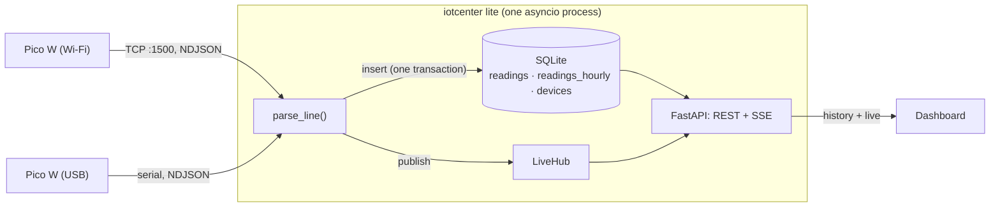
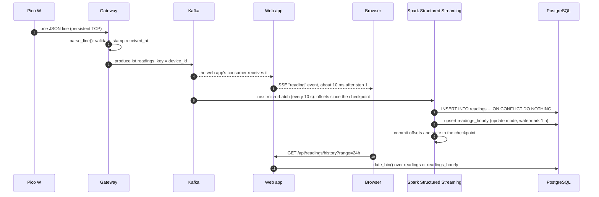

# Architecture

IoT Center moves one kind of message, a sensor reading, from a microcontroller to a browser.
This guide follows a reading through each edition, then explains the decisions behind the design,
the delivery guarantees, and what happens when each piece fails.

## The shared core

Both editions are built from the same parts:

- **The firmware** ([`firmware/`](../firmware)) reads the BME280 every `INTERVAL_S` seconds (2 by default) and
  writes one JSON line per reading to a persistent TCP connection and/or the USB serial port.
- **The contract** ([`protocol.py`](../src/iotcenter/protocol.py), [docs/protocol.md](protocol.md)) is a pydantic
  model. `parse_line()` turns bytes into a validated `Reading` or raises `InvalidMessage` with a readable reason.
- **Ingestion** ([`ingest.py`](../src/iotcenter/ingest.py)): an asyncio TCP server and a USB serial reader that
  both hand each validated reading to a callback. Lite's callback writes SQLite; the gateway's produces to Kafka.
- **The dashboard** ([`dashboard/`](../src/iotcenter/dashboard)) and its API ([`api.py`](../src/iotcenter/api.py)).
  Each edition plugs in a `DataSource` with the same six methods (devices, recent, history, readings, status, links),
  so the browser cannot tell which pipeline it is talking to.

## Lite: one process

One insert transaction does three things: it stores the raw reading (the primary key
`(device_id, event_time, seq)` silently drops a reading that was delivered twice), folds it into
`readings_hourly` (running sum, min and max per device and hour), and updates the device registry. The
registry counts **sequence gaps** (messages that never arrived) and **restarts** (the counter went back).
A reading that was actually stored is then published to the LiveHub, which pushes it to every open dashboard.

Raw readings are deleted after `retention_days` (30 by default). The hourly rows are kept forever, so a year of
history costs a few megabytes. The history API asks the raw table for buckets shorter than an hour and the
hourly table for the rest, so a 30-day chart is a scan of 720 rows, not 1.3 million.

## Platform: a streaming pipeline

| Service | Image | Role |
|---|---|---|
| `kafka` | `apache/kafka:4.3.1` | single-node KRaft broker (no ZooKeeper); 7-day retention |
| `kafka-init` | same | one-shot: creates `iot.readings` (3 partitions) and `iot.readings.dlq` |
| `gateway` | `iotcenter` (Python 3.14) | TCP :1500 (and optional USB) into Kafka; `/health`, `/stats` on :8001 |
| `spark-master`, `spark-worker` | `iotcenter-spark` (official `spark:4.2.0` + connector jars + psycopg) | standalone cluster; the worker offers 2 cores and 2 GB |
| `spark-streaming` | same | the driver: `stream_readings.py`, two streaming queries, UI on :4040 |
| `spark-rebuild` | same | on demand (`make rebuild-hourly`): recomputes `readings_hourly` from `readings` |
| `postgres` | `postgres:18-alpine` | the serving layer: `readings`, `readings_hourly`, `stream_progress`, view `devices` |
| `web` | `iotcenter` | the dashboard: live from Kafka, history from PostgreSQL, health of every stage |
| `analytics` | `iotcenter` | Streamlit on PostgreSQL |
| `kafka-ui` | `kafbat/kafka-ui` | optional (`--profile tools`): browse topics and messages |

### The Spark job

[`stream_readings.py`](../platform/spark/jobs/stream_readings.py) starts two streaming queries on one Kafka source:

- **`readings`**: `parse_readings()` applies the JSON schema, derives `event_time`, fills `dew_point_c` if it is
  missing, and drops anything outside the contract (a second line of defense, because producers that bypass the
  gateway, like the simulator's `kafka://` mode, are possible). Each micro-batch is upserted with
  `INSERT ... ON CONFLICT DO NOTHING` from the executors (`foreachPartition` + psycopg).
- **`hourly`**: `hourly_aggregates()` groups by device and one-hour event-time window, with a one-hour watermark.
  In **update mode** Spark emits the complete, current aggregate of every window that changed, and the sink
  upserts it, overwriting the previous value.

`hourly_aggregates()` is plain DataFrame code, so [`rebuild_hourly.py`](../platform/spark/jobs/rebuild_hourly.py)
reuses it unchanged on a static JDBC read of `readings`. Spark's unified batch and streaming API at work.

A `StreamingQueryListener` writes every micro-batch's progress to `stream_progress`, which is how the dashboard
and Streamlit know the job is alive and how fresh the data is.

## Design decisions

**NDJSON over one persistent TCP connection.** v1 opened a connection per message and read a single 1 KB
`recv()`, so anything larger or split across packets was corrupted. A newline-delimited stream is the simplest
framing MicroPython can do correctly. It costs one handshake per boot instead of one per reading, and needs no
broker on the device side. (MQTT would be a fine alternative; it would add a broker to Lite.)

**Validate at the edge, with one model.** Every reader uses the same pydantic `Reading`, and contract tests
compare it with the Spark schema, the SQL tables and the firmware's field names. Bad input is never silently
dropped: Lite counts it and shows the last reason, and the gateway sends it to a dead-letter topic.

**Kafka key = device.** All readings of one board land in one partition, so per-device order is preserved
end to end, while different boards spread across the three partitions.

**Streaming instead of a cron batch.** v1 re-read the entire topic every hour and overwrote the database tables.
History was therefore capped at Kafka's seven-day retention, and each run did more work as data grew.
Structured Streaming reads only new offsets, checkpoints its progress, and keeps the database as the long-term
record.

**Idempotent sinks.** Spark guarantees each micro-batch is processed *at least* once; the sinks make processing
it twice harmless. Raw rows are keyed by `(device_id, event_time, seq)`, a key that is identical for a replay,
or for a reading the device resent, but different for two real readings. Hourly rows are overwritten with the full
window value. Together with checkpointed offsets this gives effectively exactly-once results in PostgreSQL.

**Event time, not arrival time.** The firmware stamps readings with its NTP-synced clock, so buffered readings
are charted when they were measured, not when they arrived. Until the clock is synced it sends `ts: null` and the
server's arrival time is used instead.

**Raw + hourly in both editions.** Short ranges need detail and long ranges need speed. Both editions keep the same
two shapes of data, and the history API picks the table by bucket size.

**One dashboard for two pipelines.** The `DataSource` protocol is the seam: Lite answers from SQLite and its hub,
the platform from PostgreSQL and a Kafka consumer. Server-Sent Events carry the live stream: they are one-way,
work over plain HTTP, and the browser reconnects by itself. The UI is plain HTML, CSS and ES modules with one
vendored chart library (uPlot), so there is no build step and it works on a network without internet access.

**Health from the services themselves.** v1's web app mounted the Docker socket to list containers, which
grants root-equivalent access to the host. v2 asks each service: the gateway's `/stats`, the Kafka consumer's
watermarks, Spark's master JSON and `stream_progress`, PostgreSQL queries, and Streamlit's health endpoint.

## Delivery guarantees

| Hop | Guarantee | How it shows when it fails |
|---|---|---|
| Pico W to server | Buffered while Wi-Fi or the server is down (up to `BUFFER_SIZE`, oldest dropped first). A reading handed to the TCP stack just before the server dies can be lost. | Sequence gaps: "Lost in transit" on the dashboard, "Lost" in Streamlit |
| Gateway to Kafka | `acks=all` with an idempotent producer: no duplicates on retry; delivery is confirmed in the background | "Kafka delivery failures" on the Pipeline page |
| Kafka to PostgreSQL | Checkpointed offsets plus idempotent upserts: effectively exactly once | `stream_progress` stops advancing: the Spark stage turns "degraded" |
| Late data | Readings more than one hour late (for example a big backfill) are stored raw but not added to the streaming hourly aggregates | Run `make rebuild-hourly` |
| Lite | One SQLite transaction per reading; duplicates dropped by the primary key | Same sequence-gap counters |

## When things fail

| What fails | What happens | Recovery |
|---|---|---|
| Wi-Fi drops | The firmware keeps reading and buffering, and rejoins every 15 to 60 s | Automatic; buffered readings are delivered in order |
| The server or gateway is down | The firmware retries with backoff (1 s, doubling up to 30 s) | Automatic |
| The firmware hangs | The hardware watchdog reboots the board after 8 s | Automatic; visible as a restart (sequence back to 0) |
| Kafka restarts | The gateway's producer retries; the web app's consumer reconnects and replays recent messages | Automatic |
| The Spark driver dies | Docker restarts it; it resumes from the checkpoint; Kafka still holds 7 days | Automatic |
| PostgreSQL is down | Spark batches fail and are retried; the dashboard's live view keeps working from Kafka | Automatic once PostgreSQL is back |
| The web app restarts | It rewinds `IOT_REPLAY_MESSAGES` per partition to refill the live charts | Automatic |
| A board sends garbage | Lite counts it; the gateway sends it to `iot.readings.dlq` with the reason | Inspect in Kafka UI or with `kafka-console-consumer.sh` |
