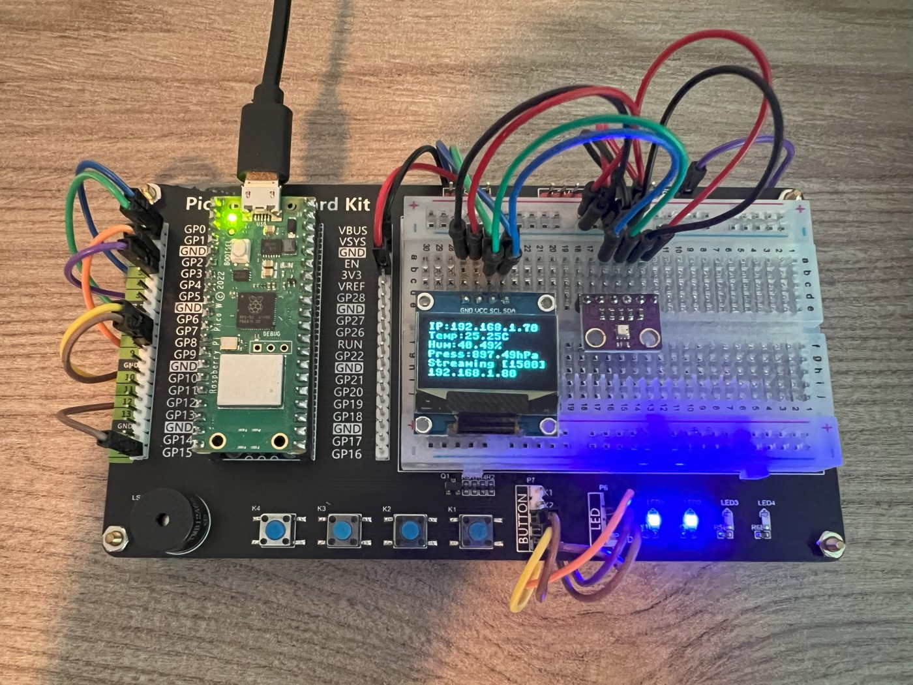
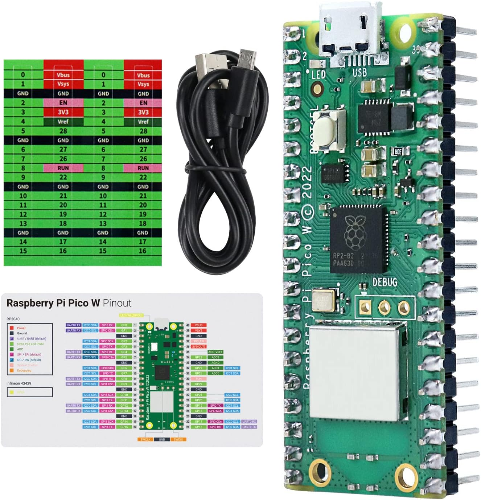
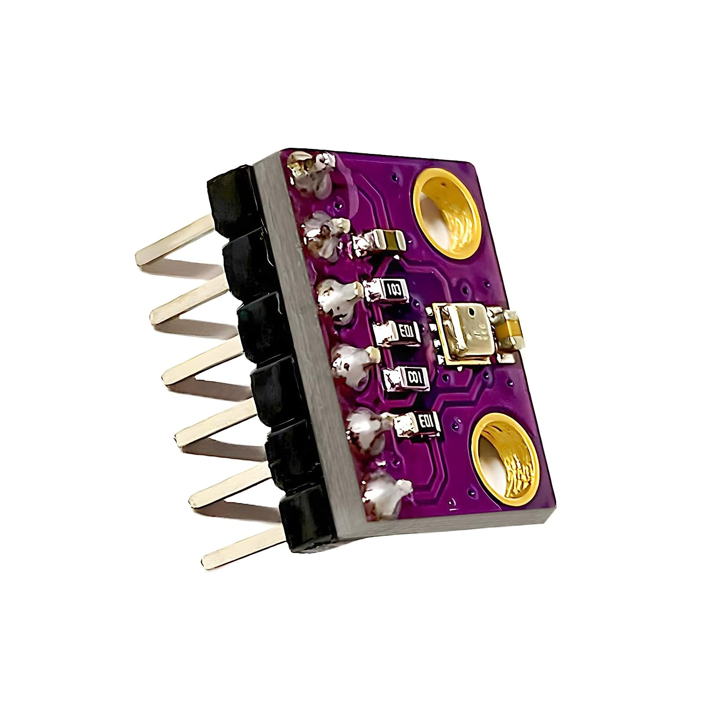
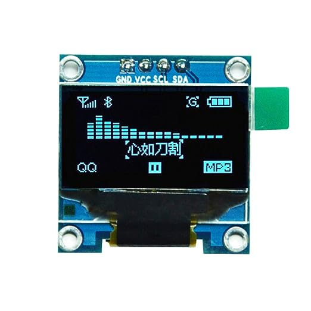
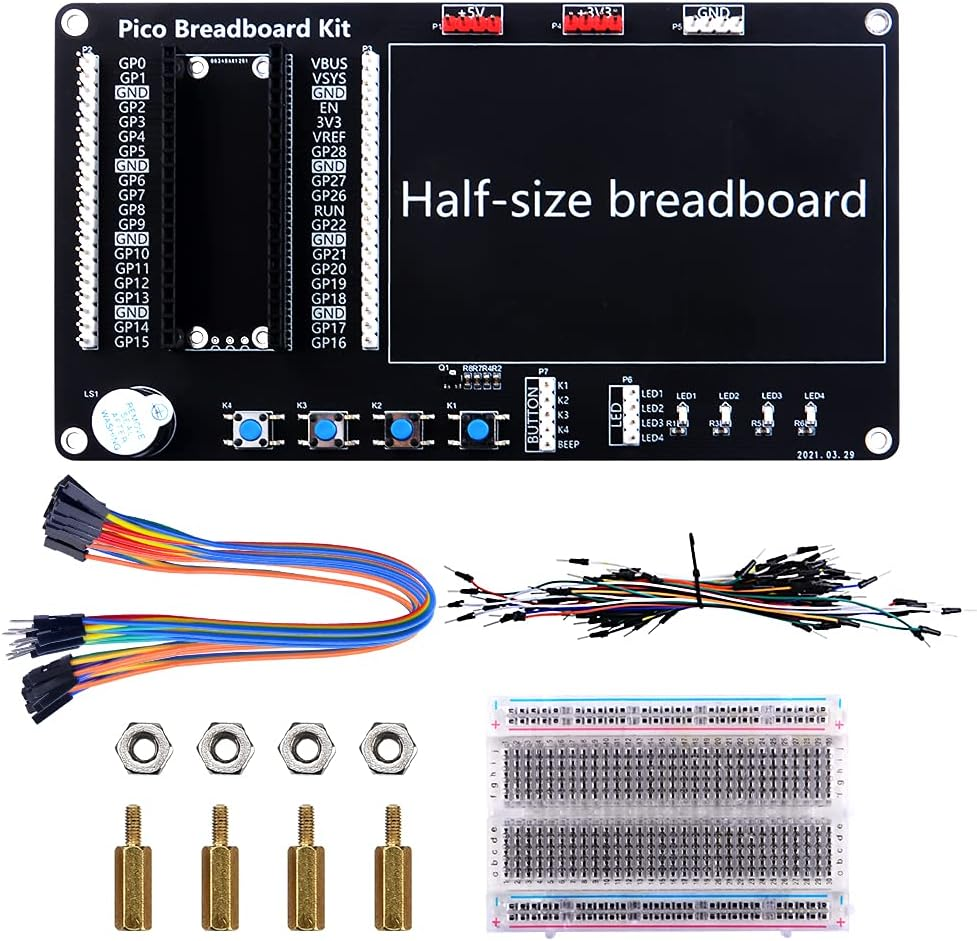

# Hardware



## Parts

| Part | Why | Notes |
|---|---|---|
| **Raspberry Pi Pico W** ([docs](https://www.raspberrypi.com/documentation/microcontrollers/raspberry-pi-pico.html), [datasheet](https://datasheets.raspberrypi.com/picow/pico-w-datasheet.pdf)) | RP2040 + Wi-Fi, runs MicroPython | A **Pico 2 W** works too (flash the `RPI_PICO2_W` build) |
| **BME280** breakout, e.g. GY-BME280 3.3 V ([datasheet](https://www.bosch-sensortec.com/media/boschsensortec/downloads/datasheets/bst-bme280-ds002.pdf), [Amazon.ca](https://www.amazon.ca/dp/B0BQFV883T)) | temperature, humidity and pressure over I2C | Make sure it is a BME280 (humidity), not a BMP280 |
| **SSD1306** 0.96" 128x64 I2C OLED ([Amazon](https://www.amazon.com/dp/B06XRBYJR8)) | shows readings and connection state | Optional: set `OLED = False` without it |
| **Breadboard kit** with buttons and LEDs, e.g. Freenove Pico breadboard kit ([Amazon.ca](https://www.amazon.ca/dp/B0BJ1PGZCX)) | quick wiring | Optional: any breadboard, two buttons and three LEDs with resistors |
| Micro-USB cable **with data lines** | power, flashing, USB mode | Charge-only cables are a classic source of "the board does not show up" |

| | | | |
|---|---|---|---|
|  |  |  |  |
| Pico W | BME280 | SSD1306 | Breadboard kit |

## Wiring

The BME280 and the display share one I2C bus. Every pin can be changed in `config.py`; `None` disables a part.

| From | To Pico W | Physical pin | `config.py` |
|---|---|---|---|
| BME280 VIN, SSD1306 VCC | 3V3(OUT) | 36 | |
| BME280 GND, SSD1306 GND | GND | 38 | |
| BME280 SDA, SSD1306 SDA | GP0 (I2C0 SDA) | 1 | `I2C_SDA = 0` |
| BME280 SCL, SSD1306 SCL | GP1 (I2C0 SCL) | 2 | `I2C_SCL = 1` |
| Button 1 (start), other leg to GND | GP7 | 10 | `BUTTON_START = 7` |
| Button 2 (pause), other leg to GND | GP8 | 11 | `BUTTON_STOP = 8` |
| LED "connected" (+ resistor to GND) | GP2 | 4 | `LED_CONNECTED = 2` |
| LED "sending" | GP3 | 5 | `LED_SENDING = 3` |
| LED "problem" | GP15 | 20 | `LED_PROBLEM = 15` |

Power the sensors from **3V3, not VBUS** (5 V). The buttons need no resistor: the firmware enables the internal pull-ups.
The BME280's address is 0x76 on most breakouts; if yours uses 0x77, set `BME280_ADDRESS = 0x77`.

## What the board shows

| Signal | Meaning |
|---|---|
| Onboard LED | toggles on every delivery |
| LED "connected" (GP2) | on while connected to the server |
| LED "sending" (GP3) | flashes on every delivery |
| LED "problem" (GP15) | on while Wi-Fi or the server is unreachable |
| Button 1 / Button 2 | resume / pause streaming (the board keeps reading the sensor either way) |

The display (16 characters by 8 lines):

```
21.6C  45%RH          temperature and humidity
1013.2 hPa            pressure
                      (spacer)
192.168.1.74          the board's IP, "no Wi-Fi" or "USB only"
srv: connected        connected · retry in 4s · reconnecting · Wi-Fi...
sent 1234             readings delivered since boot
waiting 0             readings buffered while offline
STREAMING             or PAUSED
```

## Readings you can expect

- **Board temperature** (`cpu_temp_c`) reads several degrees above the air: the RP2040 warms itself. The BME280
  also warms slightly if it sits right next to the Pico W, so give it a few centimetres of wire for room-accurate
  readings.
- **Pressure** is station pressure, so it depends on altitude: about 1013 hPa at sea level, about 888 hPa in
  Calgary (1,045 m). Weather moves it by about ±15 hPa.
- **Dew point** is computed from temperature and humidity; it is what to watch for condensation (a garage or
  basement surface colder than the dew point gets wet).

## Troubleshooting

| Symptom | Likely cause |
|---|---|
| `OSError: [Errno 5] EIO` or `ENODEV` at start | sensor not found: check SDA/SCL (not swapped), 3V3 and GND, or set `BME280_ADDRESS = 0x77`. In the REPL, `machine.I2C(0, sda=machine.Pin(0), scl=machine.Pin(1)).scan()` should list `0x76` (118) and `0x3c` (60) |
| Humidity is always missing or 0 | it is a BMP280, which has no humidity sensor |
| `no OLED display found` in the log | the display is not at 0x3C or not wired; the firmware carries on without it |
| Stuck on `Wi-Fi...` | wrong SSID or password; the Pico W only supports 2.4 GHz networks; check `WIFI_COUNTRY` |
| `srv: retry in ...` | the server is not reachable: check `SERVER_HOST`/`SERVER_PORT`, that IoT Center is running, and the host firewall (`sudo ufw allow 1500/tcp`) |
| The board reboots every few seconds | the watchdog: the program stopped (an error, or you pressed Stop in Thonny). Read the log over USB; set `WATCHDOG = False` while developing |
