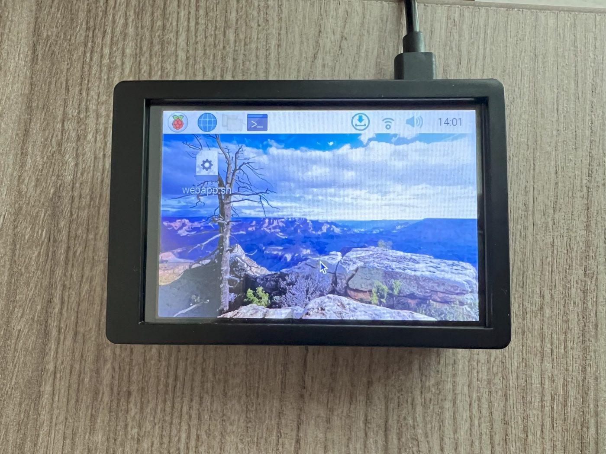

# Raspberry Pi host



The photos show a Raspberry Pi 4 (8 GB) as the host, which runs the whole platform comfortably: it uses about
3.5 GB of RAM. Lite needs about 100 MB, so even small boards will do. Any other Linux machine, or Docker Desktop
on macOS or Windows, works the same way: every image used here is published for both `arm64` and `amd64`.

## 1. Operating system

Flash **Raspberry Pi OS Lite (64-bit)** with [Raspberry Pi Imager](https://www.raspberrypi.com/software/).
In the imager's settings, set the host name (`raspberrypi`), enable SSH, and configure Wi-Fi if you will not use
Ethernet. A 64-bit OS is required: the Kafka and Spark images are `arm64`.

```bash
ssh pi@raspberrypi.local
sudo apt update && sudo apt full-upgrade -y
sudo timedatectl set-timezone America/New_York     # your time zone
```

Use a good SD card (A2) or, better, boot from a USB SSD: Kafka and PostgreSQL write continuously.

## 2. Docker

```bash
curl -fsSL https://get.docker.com | sh
sudo usermod -aG docker $USER      # then log out and back in
docker compose version             # Compose v2 ships with Docker
```

## 3. IoT Center

```bash
git clone https://github.com/mpavanetti/iot.git && cd iot
```

**Platform:**

```bash
cd platform && cp .env.example .env
# optional: WEB_PORT=80, TIMEZONE=America/New_York, KAFKA_EXTERNAL_HOST=raspberrypi.local
docker compose up -d --build
```

The first start downloads a few gigabytes of images and builds two of its own, so give it a while on a Pi.
Every service has `restart: unless-stopped`, so the stack comes back by itself after a reboot.

**Lite**, without Docker:

```bash
sudo apt install -y python3-venv
python3 -m venv .venv && . .venv/bin/activate
pip install -e ".[lite]"
iotcenter lite --serial /dev/ttyACM0    # drop --serial if the board uses Wi-Fi
```

To start Lite at boot, a systemd unit is enough. Save it as `/etc/systemd/system/iotcenter-lite.service`:

```ini
[Unit]
Description=IoT Center Lite
After=network-online.target

[Service]
User=pi
WorkingDirectory=/home/pi/iot
ExecStart=/home/pi/iot/.venv/bin/iotcenter lite
Restart=on-failure

[Install]
WantedBy=multi-user.target
```

```bash
sudo systemctl enable --now iotcenter-lite
```

## 4. Point the boards at the Pi

In `firmware/config.py`, set `SERVER_HOST` to the Pi's IP address (`hostname -I`) or to `raspberrypi.local`, if
your network resolves mDNS names for the Pico W. A fixed DHCP lease for the Pi on your router keeps the
address from changing. If a firewall is active, open the device port: `sudo ufw allow 1500/tcp`.

## Optional extras (from the v1 setup)

- **The Pi as a Wi-Fi access point** for the boards, on a network of their own: [RaspAP](https://raspap.com)
  (`curl -sL https://install.raspap.com | bash`). Its web UI listens on port 80 by default, so move the
  dashboard (`WEB_PORT`) to another port.
- **A desktop over VNC**: enable it with `sudo raspi-config` (Interface options, VNC). Not needed: everything
  here runs headless and is used from a browser.
